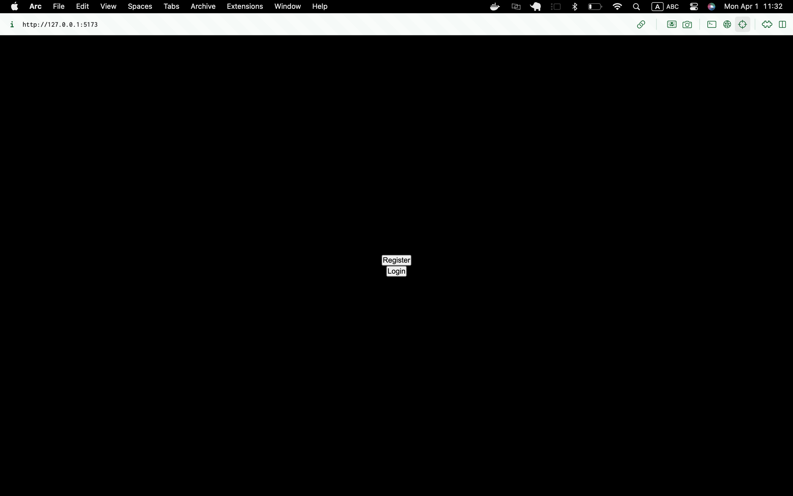
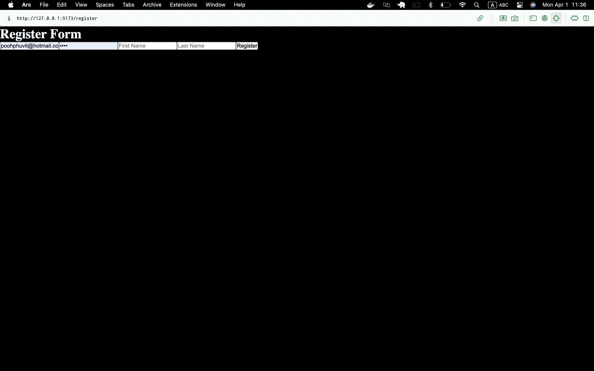
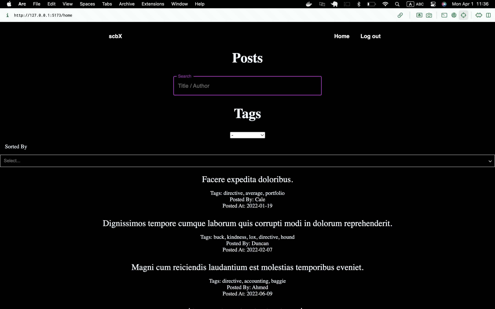
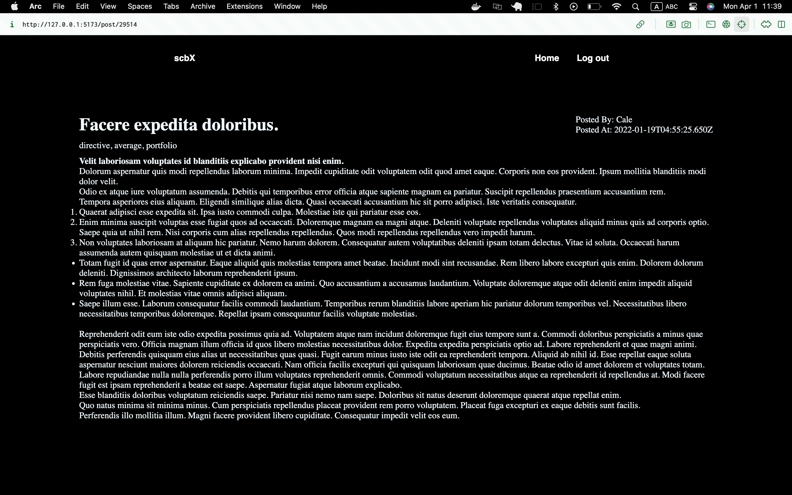

# SkinX - Software Engineer (Fullstack)

Coding test submitted to SkinX.

## Installation

Use the package manager [npm](https://www.npmjs.com/) to install dependencies for both the client and server.

### Server Setup

```bash
# Navigate to the server directory
cd scbx

# Install server dependencies
npm install

# Run docker-compose to start the Postgres container
docker-compose up -d

# Perform database migrations and seeding
npx sequelize-cli db:migrate
npx sequelize-cli db:seed:all

# Start the server
node index.js
```

## Client Setup

```bash
# Open a new terminal and navigate to the client directory from the root
cd scbClient

# Install client dependencies
npm install

# Start the client application
npm run dev
```

## run docker-compose.yml
```bash
cd scbx
docker-compose up

# db migration and seed
npx sequelize-cli db:migrate
npx sequelize-cli db:seed:all

```


## Flow
Create an account




Search for a desire post by Title / Author / Tags and Sort it on your preferences (You will be required to Log-In first)



Go into the post page (You will be required to Log-In first)




## Contributing

Pull requests are welcome. For major changes, please open an issue first
to discuss what you would like to change.

## License

[MIT](https://choosealicense.com/licenses/mit/)
